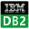

<h1 align="center">ClientBiz Web </h1>

[官网地址](https://www.clientbiz.cn)

ClientBiz是一款开源的，支持WEB和客户端版本的，能够支持连接各种类型的关系数据库、非关系型数据库、时序数据库、图数据库、消息队列、注册中心等数据服务的管理软件。


[ClientBiz IDE 源码地址](./README-zh_CN.md)

<h2 align="center">ClientBiz当前支持的客户端 </h2>

|  |  |  |  |  |
|:--------------------------------------:|:---------------------------------------------:|:-------------------:|:-------------------:|:-------------------:|
|                 mysql                  |                  postgresql                   | 图片3名称 | 图片4名称 | 图片5名称 |

|  |  |  |  |  |
|:-------------------:|:-------------------:|:-------------------:|:-------------------:|:-------------------:|
| 图片1名称 | 图片2名称 | 图片3名称 | 图片4名称 | 图片5名称 |


|  |  |  |  |  |
|:-------------------:|:-------------------:|:-------------------:|:-------------------:|:-------------------:|
| 图片1名称 | 图片2名称 | 图片3名称 | 图片4名称 | 图片5名称 |


<div align="center">
<div style="display: flex; flex-direction: row; justify-content: space-between;padding: 10px 20px">
    <div style="text-align: center;">
        
        <p>Mysql</p>
    </div>
    <div style="text-align: center;">
        
        <p>Postgresql</p>
    </div>
    <div style="text-align: center;">
        
        <p>Oracle</p>
    </div>
    <div style="text-align: center;">
        
        <p>mariadb</p>
    </div>
    <div style="text-align: center;">
        
        <p>SqlServer</p>
    </div>
    <div style="text-align: center;">
        
        <p>Redis</p>
    </div>
</div>

<div style="display: flex; flex-direction: row;justify-content: space-between;padding: 10px 20px">
    <div style="text-align: center;">
        
        <p>Zookeeper</p>
    </div>
    <div style="text-align: center;">
        
        <p>Kafka</p>
    </div>
    <div style="text-align: center;">
        
        <p>达梦</p>
    </div>
    <div style="text-align: center;">
        
        <p>TiDB</p>
    </div>
    <div style="text-align: center;">
        
        <p>OceanBase</p>
    </div>
    <div style="text-align: center;">
        
        <p>DB2</p>
    </div>
</div>
<div style="display: flex; justify-content: space-between; padding: 10px 20px">
    <div style="text-align: center;">
        
        <p>ClickHouse</p>
    </div>
    <div style="text-align: center;">
        
        <p>Presto</p>
    </div>
    <div style="text-align: center;">
        
        <p>Trino</p>
    </div>
   
</div>

</div>

## 功能特点

- 开源免费
- 支持web和客户端方式安装
- 传统IDE方式管理SQL及其他语言脚本
- 方便的Git管理SQL及其他语言脚本
- 丰富的第三方客户端支持
- 优秀的智能脚本语言提示
- 可视化操作的SQL查询结果展示


## 支持的客户端功能介绍

### 数据库支持功能


## Quick Start

```bash
$ git clone git@github.com:opensumi/ide-startup.git
$ cd ide-startup
$ yarn
$ yarn start
```

Open [http://127.0.0.1:8080](http://127.0.0.1:8080).
.


## 联系作者

作者邮箱：hanbingzi@aliyun.com


## 请作者喝杯咖啡

开源创作不易，请多支持


## 最后

注：作者断断续续的全职开发此产品已花费将近两年，都穷的无米下锅，目前正在找工作，如果有Java方面的技术岗或管理岗，希望能邮箱联系作者

## License

Licensed under the [MIT](LICENSE) license.
